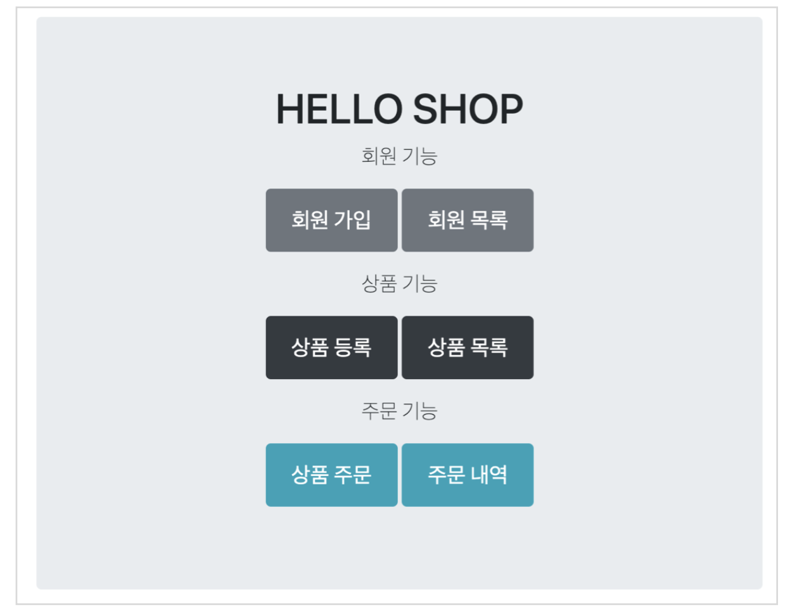
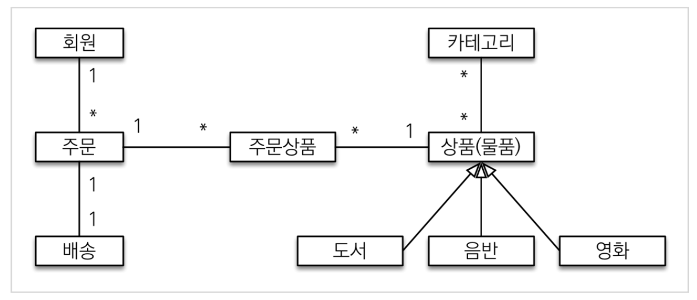
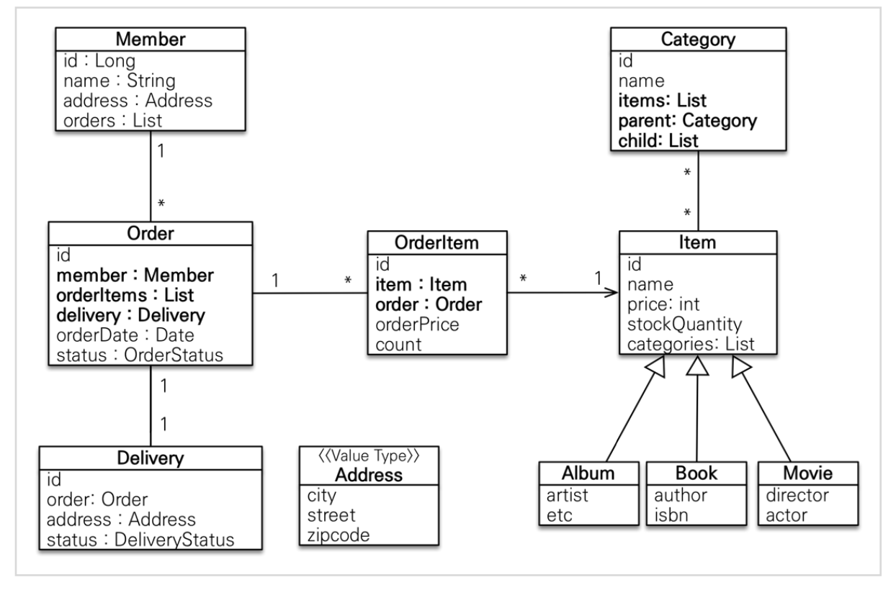
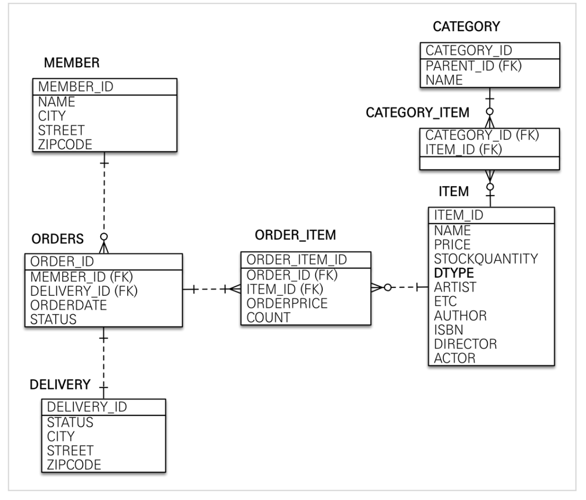
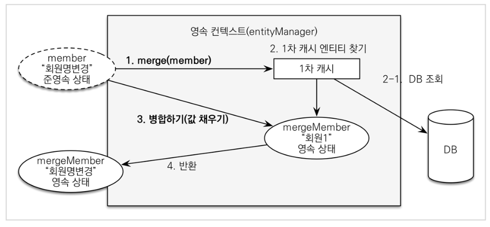

# 실전! 스프링 부트와 JPA 활용1 - 웹 애플리케이션 개발
## 구성
- 핵심 라이브러리 
  - 스프링 MVC 
  - 스프링 ORM
  - JPA, 하이버네이트
  - 스프링 데이터 JPA 
- 기타 라이브러리
  - H2 데이터베이스 클라이언트 
  - 커넥션 풀: 부트 기본은 HikariCP 
  - WEB(thymeleaf)
  - 로깅 SLF4J & LogBack
  - 테스트

### 기능 목록

- 회원 기능
  - 회원 등록
  - 회원 조회
- 상품 기능
  - 상품 등록
  - 상품 수정
  - 상품 조회
- 주문 기능 
  - 상품 주문
  - 주문 내역 조회
  - 주문 취소
- 기타 요구사항
  - 상품은 재고 관리가 필요하다.
  - 상품의 종류는 도서, 음반, 영화가 있다. 상품을 카테고리로 구분할 수 있다.
  - 상품 주문시 배송 정보를 입력할 수 있다.
---
## 도메인 모델과 테이블 설계

### 회원 엔티티 분석

### 회원 테이블 분석


> ### 참고: 외래 키가 있는 곳을 연관관계의 주인으로 정해라.
> 연관관계의 주인은 단순히 외래 키를 누가 관리하냐의 문제이지 비즈니스상 우위에 있다고 주인으로 정하면 안된다. 예를 들어서 자동차와 바퀴가 있으면, 일대다 관계에서 항상 다쪽에 외래 키가 있으므로 외래 키가 있는 바퀴를 연관관계의 주인으로 정하면 된다. 물론 자동차를 연관관계의 주인으로 정하는 것이 불가능 한 것은 아니지만, 자동차를 연관관계의 주인으로 정하면 자동차가 관리하지 않는 바퀴 테이블의 외래 키 값이 업데이트 되므로 관리와 유지보수가 어렵고, 추가적으로 별도의 업데이트 쿼리가 발생하는 성능 문제도 있다. 자세한 내용은 JPA 기본편을 참고하자.
> 

## 엔티티 설계시 주의점
### 엔티티에는 가급적 Setter를 사용하지 말자
- Setter가 모두 열려있다. 변경 포인트가 너무 많아서, 유지보수가 어렵다. 나중에 리펙토링으로 Setter 제거

### 모든 연관관계는 지연로딩으로 설정!
- 즉시로딩( `EAGER` )은 예측이 어렵고, 어떤 SQL이 실행될지 추적하기 어렵다. 특히 JPQL을 실행할 때 N+1 문제가 자주 발생한다.
- 실무에서 모든 연관관계는 지연로딩( `LAZY` )으로 설정해야 한다.
- 연관된 엔티티를 함께 DB에서 조회해야 하면, fetch join 또는 엔티티 그래프 기능을 사용한다. 
- @XToOne(OneToOne, ManyToOne) 관계는 기본이 즉시로딩이므로 직접 지연로딩으로 설정해야 한다.

### 컬렉션은 필드에서 초기화 하자.
> 컬렉션은 필드에서 바로 초기화 하는 것이 안전하다.
- null 문제에서 안전하다.
- 하이버네이트는 엔티티를 영속화 할 때, 컬랙션을 감싸서 하이버네이트가 제공하는 내장 컬렉션으로 변경한다. 만약 getOrders() 처럼 임의의 메서드에서 컬력션을 잘못 생성하면 하이버네이트 내부 메커니즘에 문제가 발생할 수 있다. 따라서 필드레벨에서 생성하는 것이 가장 안전하고, 코드도 간결하다.
```java
    Member member = new Member();
    System.out.println(member.getOrders().getClass());
    em.persist(member);
    System.out.println(member.getOrders().getClass());
    
    //출력 결과
    class java.util.ArrayList
    class org.hibernate.collection.internal.PersistentBag
```

### 테이블, 컬럼명 생성 전략
- 스프링 부트에서 하이버네이트 기본 매핑 전략을 변경해서 실제 테이블 필드명은 다름
- 하이버네이트 기존 구현: 엔티티의 필드명을 그대로 테이블의 컬럼명으로 사용 
- ( `SpringPhysicalNamingStrategy` )
- 스프링 부트 신규 설정 (엔티티(필드) 테이블(컬럼))
  1. 카멜 케이스 언더스코어(memberPoint member_point) 
  2. .(점) _(언더스코어)
  3. 대문자 소문자
### 적용 2 단계
1. 논리명 생성: 명시적으로 컬럼, 테이블명을 직접 적지 않으면 ImplicitNamingStrategy 사용 
  - `spring.jpa.hibernate.naming.implicit-strategy` : 테이블이나, 컬럼명을 명시하지 않을 때 논리명 적용,
2. 물리명 적용:
  - `spring.jpa.hibernate.naming.physical-strategy` : 모든 논리명에 적용됨, 실제 테이블에 적용 
  - (username usernm 등으로 회사 룰로 바꿀 수 있음)

## 엔티티 설계시 주의점
엔티티에는 가급적 Setter를 사용하지 말자
Setter가 모두 열려있다. 변경 포인트가 너무 많아서, 유지보수가 어렵다. 나중에 리펙토링으로 Setter 제거
모든 연관관계는 지연로딩으로 설정!
즉시로딩( EAGER )은 예측이 어렵고, 어떤 SQL이 실행될지 추적하기 어렵다. 특히 JPQL을 실행할 때 N+1 문제가 자주 발생한다.
실무에서 모든 연관관계는 지연로딩( LAZY )으로 설정해야 한다.
연관된 엔티티를 함께 DB에서 조회해야 하면, fetch join 또는 엔티티 그래프 기능을 사용한다. @XToOne(OneToOne, ManyToOne) 관계는 기본이 즉시로딩이므로 직접 지연로딩으로 설정해야 한다.
컬렉션은 필드에서 초기화 하자.
컬렉션은 필드에서 바로 초기화 하는 것이 안전하다.
null 문제에서 안전하다.
하이버네이트는 엔티티를 영속화 할 때, 컬랙션을 감싸서 하이버네이트가 제공하는 내장 컬렉션으로 변경한다. 만약 getOrders() 처럼 임의의 메서드에서 컬력션을 잘못 생성하면 하이버네이트 내부 메커니즘에 문제가 발생할 수 있다. 따라서 필드레벨에서 생성하는 것이 가장 안전하고, 코드도 간결하다.

## 변경 감지와 병합(merge)
> 참고: 정말 중요한 내용이니 꼭! 완벽하게 이해하셔야 합니다.
### 준영속 엔티티?
- 영속성 컨텍스트가 더는 관리하지 않는 엔티티를 말한다.
- (여기서는 itemService.saveItem(book) 에서 수정을 시도하는 Book 객체다. Book 객체는 이미 DB 에 한번 저장되어서 식별자가 존재한다. 이렇게 임의로 만들어낸 엔티티도 기존 식별자를 가지고 있으면 준영속 엔티티로 볼 수 있다.)

### 준영속 엔티티를 수정하는 2가지 방법 
1. 변경 감지 기능 사용
  - ```java
       @Transactional
       void update(Item itemParam) { //itemParam: 파리미터로 넘어온 준영속 상태의 엔티티
          Item findItem = em.find(Item.class, itemParam.getId()); //같은 엔티티를 조회한다.
          findItem.setPrice(itemParam.getPrice()); //데이터를 수정한다. 
       }
    ```
  - 영속성 컨텍스트에서 엔티티를 다시 조회한 후에 데이터를 수정하는 방법
  - 트랜잭션 안에서 엔티티를 다시 조회, 변경할 값 선택 트랜잭션 커밋 시점에 변경 감지(Dirty Checking) 이 동작해서 데이터베이스에 UPDATE SQL 실행
2. 병합( merge ) 사용
  - 병합은 준영속 상태의 엔티티를 영속 상태로 변경할 때 사용하는 기능이다.
  - ```java
       @Transactional
       void update(Item itemParam) { //itemParam: 파리미터로 넘어온 준영속 상태의 엔티티 
           Item mergeItem = em.merge(itemParam);
       }
    ```

### 병합: 기존에 있는 엔티티

#### 병합 동작 방식
1. merge()를 실행한다.
2. 파라미터로 넘어온 준영속 엔티티의 식별자 값으로 1차 캐시에서 엔티티를 조회한다.
   2-1. 만약 1차 캐시에 엔티티가 없으면 데이터베이스에서 엔티티를 조회하고, 1차 캐시에 저장한다.
3. 조회한 영속 엔티티( mergeMember )에 member 엔티티의 값을 채워 넣는다. (member 엔티티의 모든
   값을 mergeMember에 밀어 넣는다. 이때 mergeMember의 “회원1”이라는 이름이 “회원명변경”으로
   바뀐다.)
4. 영속 상태인 mergeMember를 반환한다.

#### 병합시 동작 방식을 간단히 정리
1. 준영속 엔티티의 식별자 값으로 영속 엔티티를 조회한다.
2. 영속 엔티티의 값을 준영속 엔티티의 값으로 모두 교체한다.(병합한다.)
3. 트랜잭션 커밋 시점에 변경 감지 기능이 동작해서 데이터베이스에 UPDATE SQL이 실행

> #### 주의 
> 변경 감지 기능을 사용하면 원하는 속성만 선택해서 변경할 수 있지만, 병합을 사용하면 모든 속성이 변경된다. 병합시 값이 없으면 null 로 업데이트 할 위험도 있다. (병합은 모든 필드를 교체한다.)