# Kevin의 알기 쉬운 RxJava 1부
## 3.리액티브 프로그래밍 구성 요소와 친해지기

### Reactive Streams란??
- 리액티브 프로그래밍 라이브러리의 표준 사양이다.
- 리액티브 프로그래밍에 대한 인터페이스만 제공한다.
- RxJava는 이 Reactive Streams의 인터페이스들을 구현한 구현체임.
- Reactive Streams는 Publisher, Subscriber, Subscription, Processor 라는 4개의 인터페이스를 제공한다.
    - Publisher : 데이터를 생성하고 통지한다.
    - Subscriber : 통지된 데이터를 전달받아서 처리한다.
    - Subscription : 전달 받을 데이터의 개수를 요청하고 구독을 해지한다.
    - Processor : Publisher와 Subscriber의 기능이 모두 있음.

#### Publisher와 Subscriber간의 프로세스 흐름
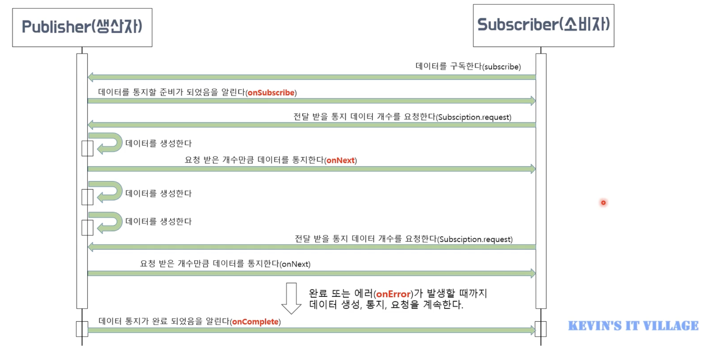

#### Cold Publisher & Hot Publisher 
- Cold Publisher(차가운 생산자) : 
    - 생산자는 소비자가 구독할 때마다 데이터를 처음부터 새로 통지한다.
    - 데이터를 통지하는 새로운 타임 라인이 생성된다.
    - 소비자는 구독 시점과 상관없이 통지된 데이터를 처음부터 전달 받을 수 있따.
- Hot Publisher(뜨거운 생산자) : 
    - 생산자는 소비자 수와 상관없이 데이터를 한번만 통지한다.
    - **즉, 데이터를 통지하는 타임라인은 하나이다.**
    - 소비자는 발행된 데이터를 처음부터 전달 받는게 아니라 구독한 시점에 통지된 데이터들만 전달 받을 수 있다.

### Observable과 Flowable에 대한 이해
#### Observable과 Flowable의 비교
| Flowable                        | Observable                              |
|---------------------------------|-----------------------------------------|
| Reactive Streams 인터페이스를 구현하지 않음 | Reactive Streams 인터페이스를 구현함             |
| Observer 에서 데이터를 처리한다.          | Subscriber 에서 데이터를 처리한다.                |
| 데이터 개수를 제어하는 **배압 기능이 없음**      | 데이터 개수를 제어하는 **배압 기능이 있음**              |
| 배압 기능이 없기 때문에 데이터 개수를 제어할 수 없다. | Subscription 으로 전달 받는 데이터 개수를 제어할 수 있다. |
| Disposable 로 구독을 해지한다.          | Subscription 으로 구독을 해지한다.               |

#### 배압(Back Pressure)이란?
- Flowable 에서 데이터를 통지하는 속도가 Subscriber 에서 통지된 데이터를 전달받아 처리하는 속도 보다 빠를 때 밸런스를 맞추기 위해 데이터 통지량을 제어하는 기능을 말한다.
  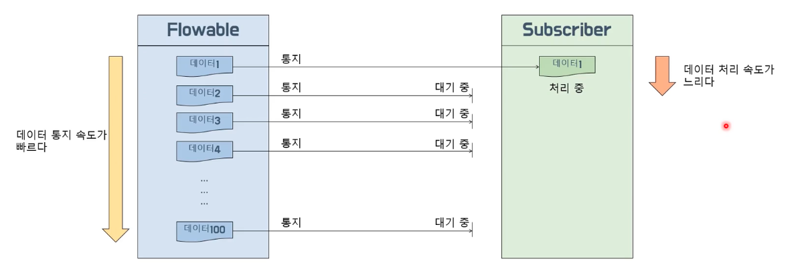

> - doOnNext() :
    >   - interval 함수에서 데이터를 통제할 때 호출되는 callBack 함수
    >   - interval 함수에서 어떻게 출력이 되는지 doOnNext() 에서 확인할 수 있음.
> - observeOn()
    >   - 데이터를 처리하는 Thread 를 분리할 수 있다.
    >   - Schedulers.~

#### 배압 전략(Backpressure Strategy)
- RxJava에서는 Backpressure Strategy 를 통해 Flowable이 통지 대기중인 데이터를 어떻게 다룰지에 대한 배압 전략을 제공한다.
- **MISSING 전략**
  - 배압을 적용하지 않는다.
  - 나중에 onBackpressureXXX() 로 배압 적용을 할 수 있다.
- **ERROR 전략**
  - 통지된 데이타가 버퍼의 크기를 초과하면 MissingBackpressureException 에러를 통지한다.
  - 즉, 소비자가 생산자의 통지 속도를 따라 잡지 못할 때 발생한다.
- **BUFFER 전략 : DROP_LATEST**
  - 버퍼가 가득 찬 시점에 버퍼 내에서 가장 최근에 버퍼로 들어온 데이터를 DROP 한다.
  - DROP 된 빈 자리에 버퍼 밖에서 대기하던 데이터를 채운다.
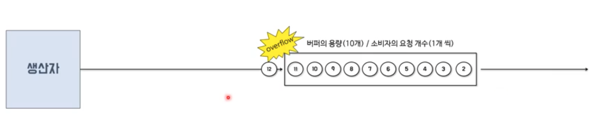
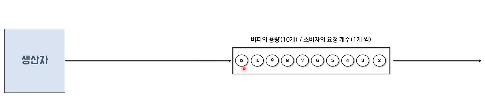
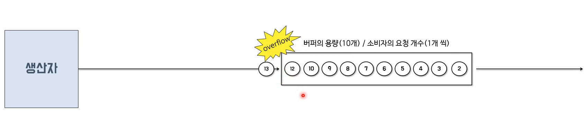
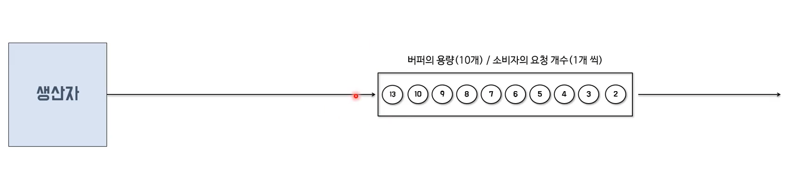
- **BUFFER 전략 : DROP_OLDEST**
  - 버퍼가 가득 찬 시점에 버퍼내에서 가장 오래전에(먼저) 버퍼로 들어온 데이터를 DROP 한다. 
  - DROP 된 빈 자리에는 버퍼 밖에서 대기하던 데이터를 채운다.
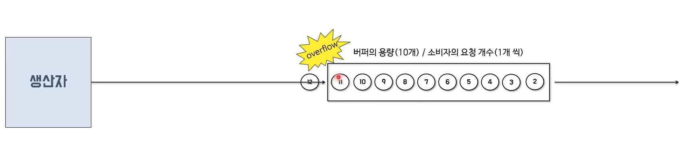
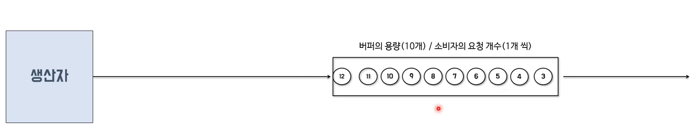
- **DROP 전략**
  - 버퍼에 데이터가 모두 채워진 상태가 되면 이후에 생성되는 데이터를 버리고(DROP), 버퍼가 비워지는 시점에 DROP 되지 않은 데이터부터 다시 버퍼에 담는다.
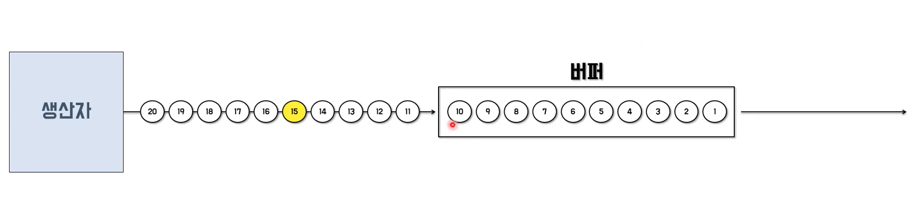
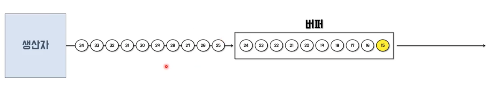
- **LATEST 전략**
  - 버퍼에 데이터가 모두 채워진 상태가 되면 버퍼가 비워질 때까지 통지된 데이터는 버퍼 밖에서 대기하며 버퍼가 비워지는 시점에 가장 나중에(최근에) 통지된 데이터부터 버퍼에 담는다.
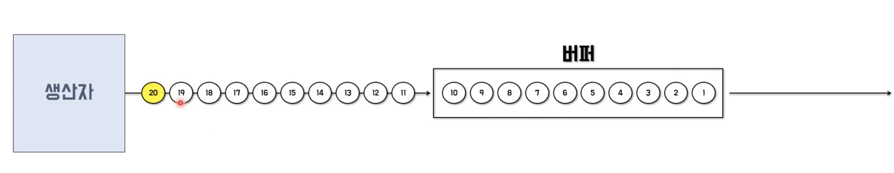
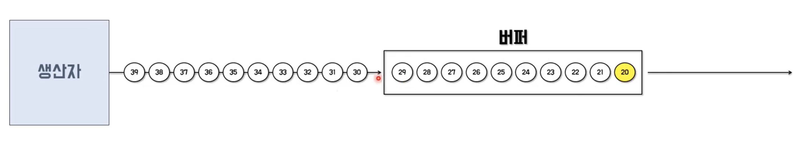

### Single, Maybe, Completable
#### Single
- 데이터를 1건만 통지하거나 에러를 통지한다.
- 데이터 통지 자체를 완룔르 의미하기 때문에 완료 통지는 하지 않는다.
- 데이터를 1건만 통지하므로 데이터 개수를 요청할 필요가 없다.
- onNext(), onComplete()가 없으며 이 둘을 합한 onSuccess() 를 제공한다.
- Single 의 대표적인 소비자는 SingleObserver 이다.
- 클라이언트의 요청에 대응하는 서버의 응답이 Single 을 사용하기 좋은 대표적인 예다.

#### Maybe
- 데이터를 1건만 통지하거나 1건도 통지하지 않고 완료 또는 에러를 통지한다.
- 데이터 통지 자체가 완료를 의미하기 때문에 완료 통지는 하지 않는다.
- 단, 데이터를 1건도 통지하지 않고 처리가 종료될 경우에는 완료 통지를 한다.
- Maybe 의 대표적인 소비자는 MaybeObserver 이다.

#### Completable
- 데이터 생산자이지만 데이터를 1건도 통지하지 않고 완료 또는 에러를 통지한다.
- **데이터 통지의 역할 대신에 Completable 내에서 특정 작업을 수행한 후, 해당 처리가 끝났음을 통지하는 역할을 한다.**
- Completable 의 대표적인 소비자는 CompletableObserver 이다.

