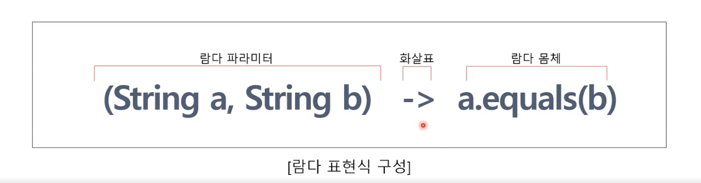

# Kevin의 알기 쉬운 RxJava 1부
## 4. Java에서의 함수형 프로그래밍 기본 지식

### 함수형 인터페이스와 람다의 개념 파악
#### 함수형 인터페이스란?
- 함수형 인터페이스는 말 그대로 Java 의 interface 이다.
- 함수형 인터페이스는 단 하나의 추상 메서드만 가지고 있는 인터페이스이다.(예외 : 디폴트 메서드는 포함할 수 있음)
- **함수형 인터페이스의 메서드는 람다 표현식을 작성해서 다른 메서드의 파라미터로 전달할 수 있다.**
- **즉, 람다 표현식 전체를 해당 함수형 인터페이스를 구현한 클래스의 인스턴스로 취급한다.**
- Java 8 에서 새롭게 추가된 함수형 인터페이스 외에 기존에 작성되어 있는 하나의 추상 메서드만 가지고 있는 Java 의 interface 또한 함수형 인터페이스로 취급할 수 있다.

#### 람다 표현식
- 람다 표현식은 함수형 인터페이스를 구현한 클래스 즉, 익명 클래스의 메서드를 단순화한 표현식이다.
- **함수형 인터페이스의 메서드를 람다 표현식으로 작성해서 다른 메서드의 파라미터로 전달할 수 있다.**
- **즉, 람다 표현식 전체를 해당 함수형 인터페이스를 구현한 클래스의 인스턴스로 취급한다.**

> 람다 파라미터 : 함수형 인터페이스에서 메서드가 전달받는 파라미터
> 람다 몸체 : 구현해야할 메서드의 몸체 부분

#### 함수 디스크립터(Function Descriptor)
- 함수형 인터페이스의 추상 메서드를 설명해놓은 시그니처를 함수 디스크립터(Function Descriptor)라고 한다.
- Java 8 에서는 java.util.function 패키지로 다양한 새로운 함수형 인터페이스를 지원한다.

| 함수형 인터페이스           | 함수 디스크립터          |
|---------------------|-------------------|
| Predicate<T>        | T -> boolean      |
| Consumer<T>         | T -> void         |
| Function<T, R>      | T -> R            |
| Supplier<T>         | () -> T           |
| BiPredicate<L, R>   | (L, R) -> boolean |
| BiConsumer<T, U>    | (T, U) -> void    |
| BiFunction<T, U, R> | (T, U) -> R       |
 