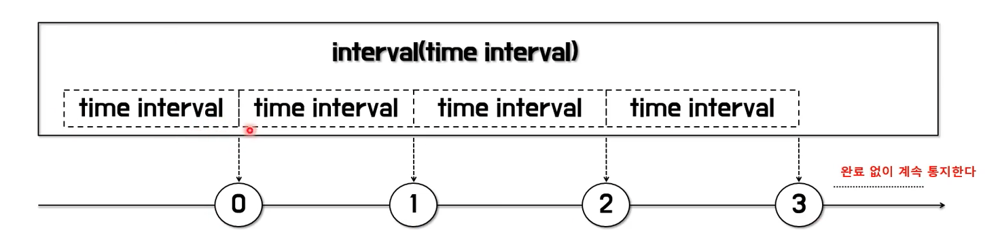
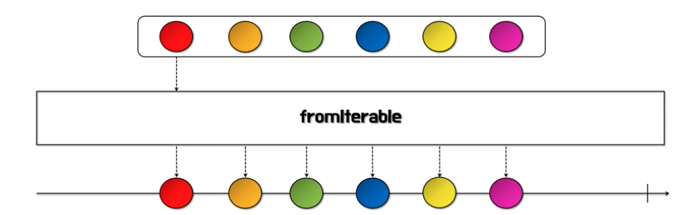
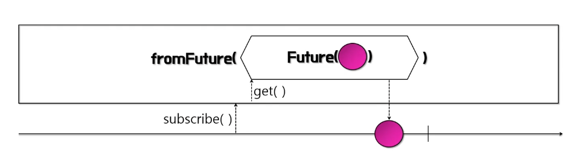
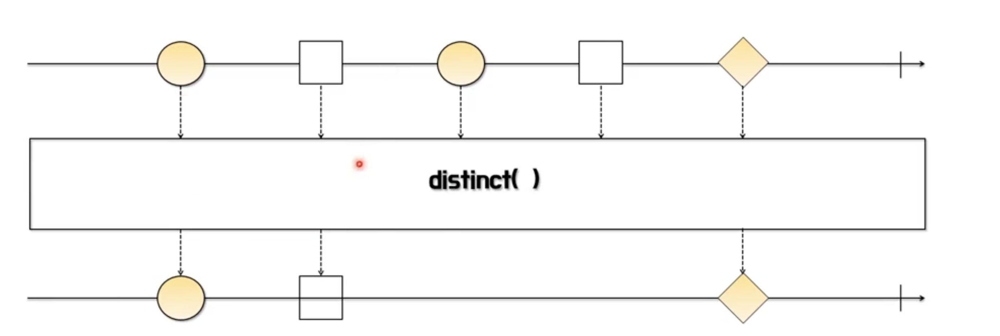
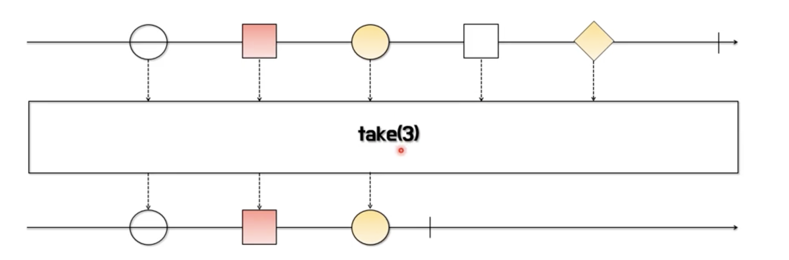
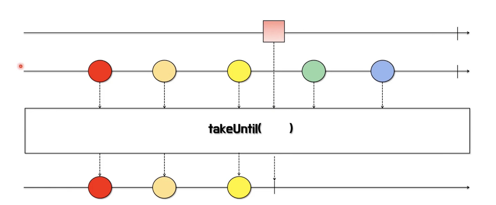
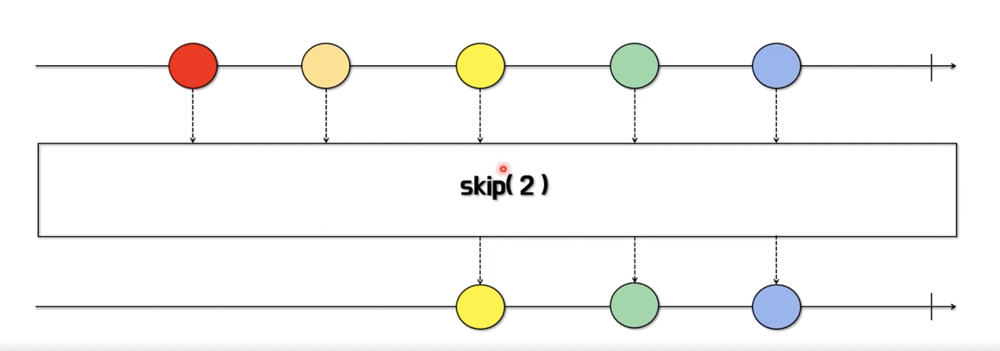
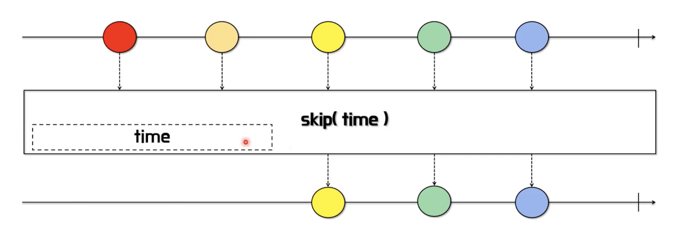
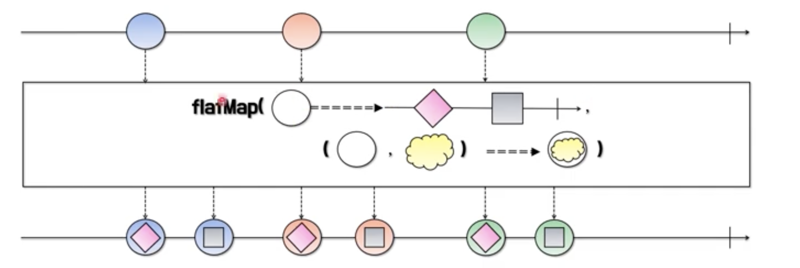

# Kevin의 알기 쉬운 RxJava 1부
## 5. 리액티브 연산자(Reactive Operators)에 익숙해지기

### 리액티브 연산자 개요 및 생성 연산자
#### RxJava의 연산자(Operator)란?
- RxJava에서의 연산자는 메서드(함수)다.
- 연산자를 이용하여 데이터를 생성하고 통지하는 Flowable 이나 Observable 등의 생산자를 생성할 수 있다.
- Flowable 이나 Observable 에서 통지한 데이터를 다양한 연산자를 사용하여 가공 처리하여 결과값을 만들어 낸다.
- 연산자의 특성에 따라 카테고리로 분류된다.
  
#### Flowable/Observable 생성 연산자
- **interval**
  - 지정된 시간 간격마다 0부터 시작하는 숫자(Long)를 통지한다.
  - initialDelay 파라미터 이용해서 최초 통지에 대한 대기 시간을 지정할 수 있다.
  - 완료 없이 계속 통지한다.
  - 호출한 스레드와는 별도의 스레드에서 실행된다.
  - polling 용도의 작업을 수행할 때 활용할 수 있다.
    
- **range**
  - 지정한 값(n) 부터 m 개의 숫자(Integer)를 통지한다.
  - for, while 문 등의 반복문을 대체할 수 있다.
    
- **timer**
  - 지정한 시간이 지나면 0(Long)을 통지한다.
  - 0을 통지하고 onComplete() 이벤트가 발생하여 종료한다.
  - 호출한 스레드와는 별도의 스레드에서 실행된다.
  - 특정 시간에 대기한 후에 어떤 처리를 하고자 할 때 활용할 수 있다.
    
- **defer**
  - 구독이 발생할 때마다 즉, subscribe() 가 호출될 때마다 새로운 Observable을 생성한다.
  - 선언한 시점의 데이터를 통지하는 것이 아니라 호출 시점의 데이터를 통지한다.
  - 데이터 생성을 미루는 효과가 있기 때문에 최신 데이터를 얻고자할 때 활용할 수 있다.
  
- **fromIterable**
  - Iterable 인터페이스를 구현한 클래스(ArrayList 등)를 파라미터로 받는다.
  - Iterable 에 담긴 데이터를 순서대로 통지한다.
  
- **fromFuture**
  - Future 인터페이스는 자바 5에서 비동기 처리를 위해 추가된 동시성 API 이다.
  - 시간이 오래 걸리는 작업은 Future 를 반환하는 ExcutorService 에게 맡기고 비동기로 다른 작업을 수행할 수 있다.
  - Java 8에서는 CompletableFuture 클래스를 통해 구현이 간결해졌다.
  

### 데이터 필터링 연산자
#### 데이터 필터링 연산자
- **filter**
  - 전달 받은 데이터가 조건에 맞는지 확인한 후, 결과가 true 인 데이터만 통지한다.
  - filter 라는 단어의 사전적 의미가 무언가를 걸러낸다는 의미이다.
  - 파라미터로 받는 Predicate 함수형 인터페이스에서 조건을 확인한다.

- **distinct**
  - 이미 통지된 동일한 데이터가 있다면 이후의 동일한 데이터는 통지 하지 않는다.
  - distinct 의 사전적 의미는 '명확하게 구별되는' 이라는 뜻을 포함하고 있다.

- **take**
  - 파라미터로 지정한 개수나 기간이 될 때까지 데이터를 통지한다.
  - 지정한 범위가 통지 데이터보다 클 경우 데이터를 모두 통지하고 완료한다.

- **takeUntil 첫번째 유형**
  - 파라미터로 지정한 조건이 true 가 될 때까지 데이터를 계속 통지한다. 

- **takeUntil 첫번째 유형**
  - 파라미터로 지정한 Observable 이 최초 데이터를 통지할 때까지 데이터를 계속 통지한다.

- **skip 첫번째 유형**
  - 파라미터로 지정한 숫자만큼 데이터를 건너뛴 후 나머지 데이터를 통지한다.

- **skip 두번째 유형**
  - 파라미터로 지정한 시간동안에는 데이터를 통지를 건너뛴 후 지정한 시간 이 후, 나머지 데이터를 통지한다.

### 변환 연산자
#### 데이터 변환 연산자  
- **map**
  - 원본 Observable 에서 통지하는 데이터를 원하는 값으로 변환 후 통지한다.
  - 변환 전, 후 데이터 타입은 달라도 상관없다.
  - null 을 반환하면 NullPointException 이 발생하므로 null 이 아닌 데이터 하나를 반드시 반환해야 한다.
    
- **flatMap 첫번째 유형**
  - 원본 데이터를 원하는 값으로 변환 후 통지하는것은 map 과 같다.
  - map 이 1대1 변환인 것과 달리 flatMap 은 1대다 변환하므로 데이터 한개로 여러 데이터를 통지할 수 있다.
  - map 은 변환된 데이터를 반환하지만 flatMap 은 변환된 여러 개의 데이터를 담고 있는 새로운 Observable 을 반환한다.
    
- **flatMap 두번째 유형**
  - 원본 데이터와 변환된 데이터를 조합해서 새로운 데이터를 통지한다.
  - 즉, Observable 에 **원본 데이터 + 변환된 데이터 = 최종 데이터**를 실어서 반환한다.
    
