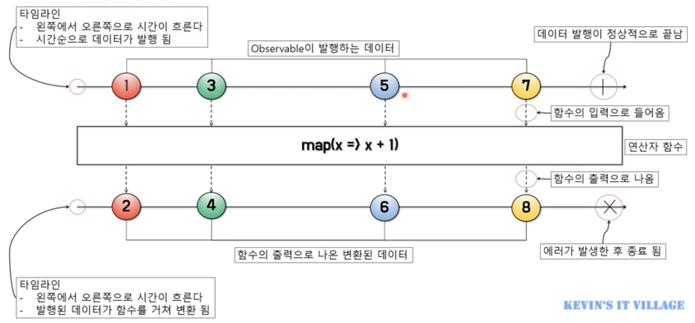
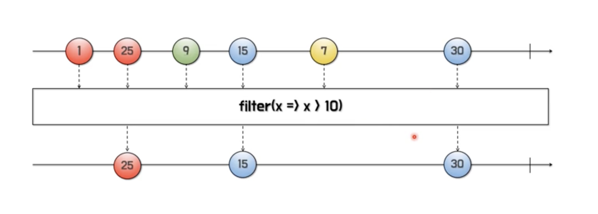
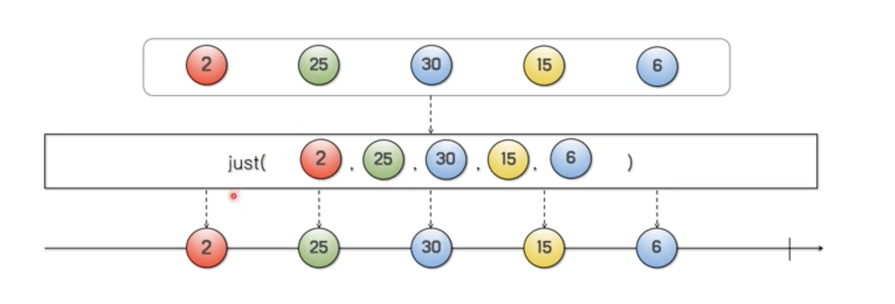

# Kevin의 알기 쉬운 RxJava 1부
## 1.리액티브(Reactive) 프로그래밍 개요
> RxJava 기본 Process : **발행 => 가공 => 구독 => 처리** 

### 리액티브의 개념이 적용된 예
- Push 방식 : 데이터의 변화가 발생했을 때 변경이 발생한 곳에서 데이터를 보내주는 방식
    - RTC(Real Time Communication)
    - 소켓 프로그래밍
    - DB Trigger
    - Spring의 ApplicationEvent
    - Angular의 데이터 바인딩
    - 스마트폰의 Push 메시지
- Pull 방식 : 변경된 데이터가 있는지 요청을 보내 질의하고 변경된 데이터를 가져오는 방식
    - 클라이언트 요청 & 서버 응답 방식의 애플리케이션
    - Java와 같은 절차형 프로그래밍 언어

### 리액티브 프로그래밍을 위해 알아야 될 것들
- Observable : 데이터 소스
- 리엑티브 연산자(Operators) : 데이터 소스를 처리하는 함수
- 스케쥴러(Scheduler) : 스레드 관리자
- Subscriber : Observable이 발행하는 데이터를 구독하는 구독자
- 함수형 프로그래밍 : RxJava에서 제공하는 연산자(Operator) 함수를 사용

## 2.마블 다이어그램 소개
> 리액티브 프로그래밍을 통해 발생하는 비동기적인 데이터의 흐름을 시간의 흐름에 따라 시각적으로 표시한 다이어그램
- 마블 다이어그램을 알아야 하는 이유
    - **문장으로 적혀 있는 리액티브 연산자(Operators)의 기능을 이해하기 어려움**
    - **리액티브 연산자의 기능이 시각화 되어 있어서 이해하기 쉬움**
    - **리액티브 프로그래밍의 핵심인 연산자(Operators)를 사용하기 위한 핵심 도구**
 
 
 
 