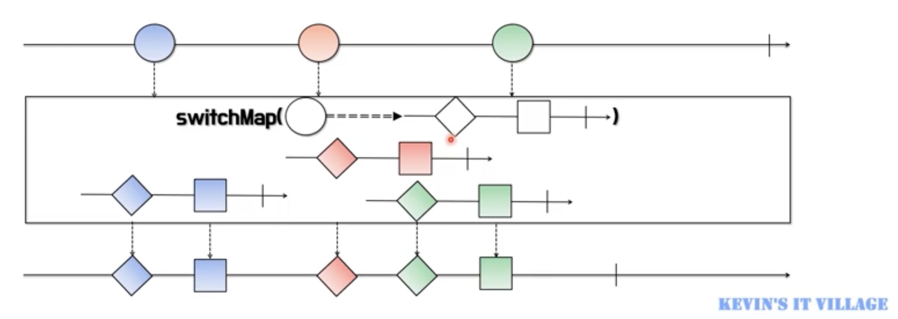
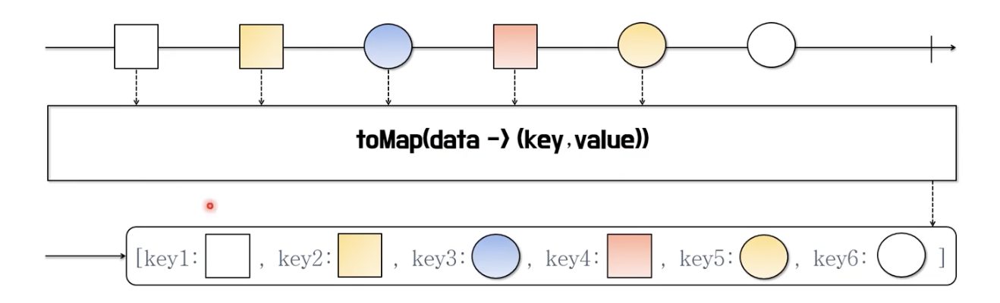

# Kevin의 알기 쉬운 RxJava 1부
## 5. 리액티브 연산자(Reactive Operators)에 익숙해지기

### 리액티브 연산자 개요 및 생성 연산자
#### RxJava의 연산자(Operator)란?
- RxJava에서의 연산자는 메서드(함수)다.
- 연산자를 이용하여 데이터를 생성하고 통지하는 Flowable 이나 Observable 등의 생산자를 생성할 수 있다.
- Flowable 이나 Observable 에서 통지한 데이터를 다양한 연산자를 사용하여 가공 처리하여 결과값을 만들어 낸다.
- 연산자의 특성에 따라 카테고리로 분류된다.
  
#### Flowable/Observable 생성 연산자
- **interval**
  - 지정된 시간 간격마다 0부터 시작하는 숫자(Long)를 통지한다.
  - initialDelay 파라미터 이용해서 최초 통지에 대한 대기 시간을 지정할 수 있다.
  - 완료 없이 계속 통지한다.
  - 호출한 스레드와는 별도의 스레드에서 실행된다.
  - polling 용도의 작업을 수행할 때 활용할 수 있다.
    
- **range**
  - 지정한 값(n) 부터 m 개의 숫자(Integer)를 통지한다.
  - for, while 문 등의 반복문을 대체할 수 있다.
    
- **timer**
  - 지정한 시간이 지나면 0(Long)을 통지한다.
  - 0을 통지하고 onComplete() 이벤트가 발생하여 종료한다.
  - 호출한 스레드와는 별도의 스레드에서 실행된다.
  - 특정 시간에 대기한 후에 어떤 처리를 하고자 할 때 활용할 수 있다.
    
- **defer**
  - 구독이 발생할 때마다 즉, subscribe() 가 호출될 때마다 새로운 Observable을 생성한다.
  - 선언한 시점의 데이터를 통지하는 것이 아니라 호출 시점의 데이터를 통지한다.
  - 데이터 생성을 미루는 효과가 있기 때문에 최신 데이터를 얻고자할 때 활용할 수 있다.
  
- **fromIterable**
  - Iterable 인터페이스를 구현한 클래스(ArrayList 등)를 파라미터로 받는다.
  - Iterable 에 담긴 데이터를 순서대로 통지한다.
  
- **fromFuture**
  - Future 인터페이스는 자바 5에서 비동기 처리를 위해 추가된 동시성 API 이다.
  - 시간이 오래 걸리는 작업은 Future 를 반환하는 ExcutorService 에게 맡기고 비동기로 다른 작업을 수행할 수 있다.
  - Java 8에서는 CompletableFuture 클래스를 통해 구현이 간결해졌다.
  

### 데이터 필터링 연산자
#### 데이터 필터링 연산자
- **filter**
  - 전달 받은 데이터가 조건에 맞는지 확인한 후, 결과가 true 인 데이터만 통지한다.
  - filter 라는 단어의 사전적 의미가 무언가를 걸러낸다는 의미이다.
  - 파라미터로 받는 Predicate 함수형 인터페이스에서 조건을 확인한다.

- **distinct**
  - 이미 통지된 동일한 데이터가 있다면 이후의 동일한 데이터는 통지 하지 않는다.
  - distinct 의 사전적 의미는 '명확하게 구별되는' 이라는 뜻을 포함하고 있다.

- **take**
  - 파라미터로 지정한 개수나 기간이 될 때까지 데이터를 통지한다.
  - 지정한 범위가 통지 데이터보다 클 경우 데이터를 모두 통지하고 완료한다.

- **takeUntil 첫번째 유형**
  - 파라미터로 지정한 조건이 true 가 될 때까지 데이터를 계속 통지한다. 

- **takeUntil 첫번째 유형**
  - 파라미터로 지정한 Observable 이 최초 데이터를 통지할 때까지 데이터를 계속 통지한다.

- **skip 첫번째 유형**
  - 파라미터로 지정한 숫자만큼 데이터를 건너뛴 후 나머지 데이터를 통지한다.

- **skip 두번째 유형**
  - 파라미터로 지정한 시간동안에는 데이터를 통지를 건너뛴 후 지정한 시간 이 후, 나머지 데이터를 통지한다.

### 변환 연산자
#### 데이터 변환 연산자  
- **map**
  - 원본 Observable 에서 통지하는 데이터를 원하는 값으로 변환 후 통지한다.
  - 변환 전, 후 데이터 타입은 달라도 상관없다.
  - null 을 반환하면 NullPointException 이 발생하므로 null 이 아닌 데이터 하나를 반드시 반환해야 한다.
    
- **flatMap 첫번째 유형**
  - 원본 데이터를 원하는 값으로 변환 후 통지하는것은 map 과 같다.
  - map 이 1대1 변환인 것과 달리 flatMap 은 1대다 변환하므로 데이터 한개로 여러 데이터를 통지할 수 있다.
  - map 은 변환된 데이터를 반환하지만 flatMap 은 변환된 여러 개의 데이터를 담고 있는 새로운 Observable 을 반환한다.
    
- **flatMap 두번째 유형**
  - 원본 데이터와 변환된 데이터를 조합해서 새로운 데이터를 통지한다.
  - **순서를 보장하지 않는다.**
  - 즉, Observable 에 **원본 데이터 + 변환된 데이터 = 최종 데이터**를 실어서 반환한다.
    
- **concatMap**
  - flatMap 과 마찬가지로 받은 데이터를 변환하여 새로운 Observable 로 반환한다.
  - 반환된 새로운 Observable 을 **하나씩 순서대로 실행하는 것**이 FlatMap 과 다르다.
  - 즉, **데이터의 처리 순서는 보장**하지만 처리중인 Observable 의 처리가 끝나야 다음 Observable 이 실행되므로 처리 성능에는 영향을 줄 수 있다.
    - flatMap 에 비해 속도가 느리다.
    
- **switchMap**
  - concatMap 과 마찬가지로 받은 데이터를 변환하여 새로운 Observable 로 반환한다.
  - concatMap 과 다른점은 **switchMap 은 순서를 보장하지만 새로운 데이터가 통지되면 현재 처리중이던 작업을 바로 중단**한다.
    

#### 데이터 변환 연산자
- **groupBy**
  - 하나의 Observable 을 여러개의 새로운 GroupedByObservable 로 만든다.
  - 원본 Observable 의 데이터를 그룹별로 묶는다기보다는 각각의 데이터들이 그룹에 해당하는 Key 를 가지게 된다.
  - GroupedByObservable 은 getKey()를 통해 구분된 그룹을 알 수 있게 해준다.
    
- **toList**
  - 통지되는 데이터를 모두 List 에 담아 통지한다.
  - 원본 Observable 에서 완료 통지를 받는 즉시 리스트를 통지한다.
  - 통지되는 데이터는 원본 데이터를 담은 리스트 하나이므로 Single 로 반환된다.
    
- **toMap**
  - 통지되는 데이터를 모두 Map 에 담아 통지한다.
  - 원본 Observable 에서 완료 통지를 받는 즉시 Map 을 통지한다.
  - 이미 사용중인 key(키)를 또 생성하면 **기존에 있던 key(키)와 value(값)를 덮어쓴다.**
  - 통지되는 데이터는 원본 데이터를 담은 Map 하나이므로 Single 로 반환된다. 
    

### 결합 연산자
#### 데이터 결합 연산자
- **merge**
  - 다수의 Observable 에서 통지된 데이터를 받아서 다시 하나의 Observable 로 통지한다.
  - 통지 시점이 빠른 Observable 의 데이터부터 순차적으로 통지되고 통지 시점이 같을 경우에는 merge() 함수의 파라미터로 먼저 지정된 Observable 의 데이터부터 통지된다. 
  
  
- **concat**
  - 다수의 Observable 에서 통지된 데이터를 받아서 다시 하나의 Observable 로 통지한다.
  - 하나의 Observable 에서 통지가 끝나면 다음 Observable 에서 연이어서 통지가 된다.
  - 각 Observable 의 통지 시점과는 상관없이 concat() 함수의 파라미터로 먼저 입력된 Observable 의 데이터부터 모두 통지된 후, 다음 Observable 의 데이터가 통지된다.
  
- **zip**
  - 다수의 Observable 에서 통지된 데이터를 받아서 다시 하나의 Observable 로 통지한다.
  - 각 Observable 에서 통지된 데이터가 모두 모이면 각 Observable 에서 **동일한 index 의 데이터로 새로운 데이터를 생성**한 후 통지한다.
  - 통지하는 데이터 개수가 가장 적은 Observable 의 통지 시점에 완료 통지 시점을 맞춘다.
    
- **combineLatest**
  - 다수의 Observable 에서 통지된 데이터를 받아서 다시 하나의 Observable 로 통지한다.
  - 각 Observable 에서 데이터를 통지할 때마다 모든 Observable 에서 마지막으로 통지한 각 데이터를 함수형 인터페이스에 전달하고, 새로운 데이터를 생성해 통지한다.
    

### 에러 처리 연산자
- **onErrorReturn**
  - 에러가 발생했을 때 에러를 의미하는 데이터로 대체할 수 있다.
  - onErrorReturn()을 호출하면 onError 이벤트는 발생하지 않는다.   
    
- **onErrorResumeNext**
  - 에러가 발생했을 때 에러를 의미하는 Observable 로 대체할 수 있다.
  - Observable 로 대체할 수 있으므로 데이터 교체와 더불어 에러 처리를 위한 추가 작업을 할 수 있다.
    
- **retry**
  - 데이터 통지 중 에러가 발생했을 때, 데이터 통지를 재시도 한다.
  - 즉, onError 이벤트가 발생하면 subscribe()를 다시 호출하여 재구독한다.
  - **에러가 발생한 시점에 통지에 실패한 데이터만 다시 통지되는 것이 아니라 처음부터 다시 통지된다.**
    

### 유틸리티 연산자
- **delay 첫번째 유형**
  - 생산자가 데이터를 생성 및 통지를 하지만 설정한 시간만큼 소비자쪽으로의 데이터 전달을 지연시킨다.
    
- **delay 두번째 유형**
  - 파라미터로 생성되는 Observable 이 데이터를 통지할때까지 각각의 원본 데이터의 통지를 지연시킨다.
    
- **delaySubscription**
  - 생산자가 데이터의 생성 및 통지 자체를 설정한 시간만큼 지연시킨다.
  - 즉, 소비자가 구독을 해도 구독 시점 자체가 지연된다.
    
- **timeout**
  - 각각의 데이터 통지 시, 지정된 시간안에 통지가 되지 않으면 에러를 통지한다.
  - 에러 통지 시 전달되는 에러 객체는 TimeoutException 이다.
    
- **timeInterval**
  - 각각의 데이터가 통지되는데 **걸린 시간을 통지**한다.
  - 통지된 데이터와 데이터가 통지되는데 걸린 시간을 소비자쪽에서 모두 처리할 수 있다.
    
- **materialize/dematerialize**
  - materialize : 통지된 데이터와 통지된 데이터의 통지 타입 자체를 Notification 객체에 담고 이 Notification 객체를 통지한다. 즉, 통지 데이터의 메타 데이터를 포함해서 통지한다고 볼 수 있다.
  - dematerialize : 통지된 Notification 객체를 원래의 통지 데이터로 변환해서 통지한다. 
    
    

### 조건과 boolean 연산자
- **all**
  - 통지되는 모든 데이터가 설정한 조건에 맞는지를 판단한다.
  - 결과값을 한번만 통지하면 되기 때문에 true/false 값을 Single 로 반환한다.
  - 통지된 데이터가 조건에 맞지 않는다면 이후 데이터는 구독 해지되어 통지되지 않는다.
     
- **amb**
  - 여러개의 Observable 중에서 최초 통지 시점이 가장 빠른 Observable 의 데이터만 통지되고, 나머지는 Observable 은 무시된다.
  - 즉, 가장 먼저 통지를 시작한 Observable 의 데이터만 통지된다.
     
- **contains**
  - 파라미타의 데이터가 Observable 에 포함되어 있는지를 판단한다. 
  - 결과값을 한번만 통지하면 되기 때문에 true/false 값을 Single 로 반환한다.
  - 결과 통지 시점은 Observable 에 포함된 데이터를 통지하거나 완료를 통지할때이다.
     
- **defaultIfEmpty**
  - 통지할 데이터가 없을 경우 파라미터로 입력된 값을 통지한다. 
  - 즉, 연산자 이름 의미 그대로 Observable 에 통지할 데이터가 없이 비어 있는 상태일때 디폴트 값을 통지한다.
     
