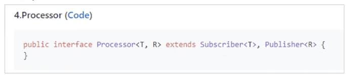
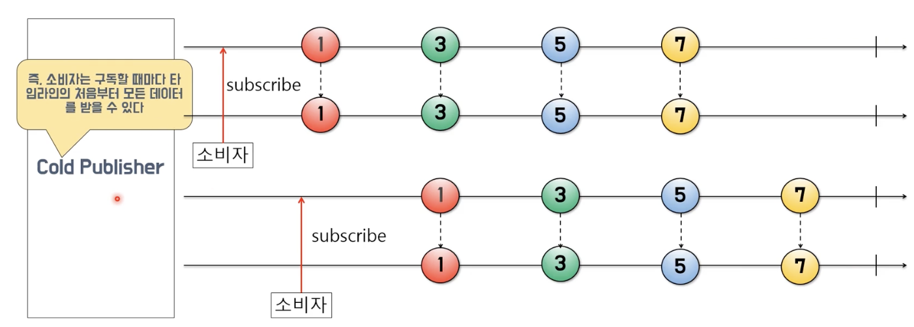
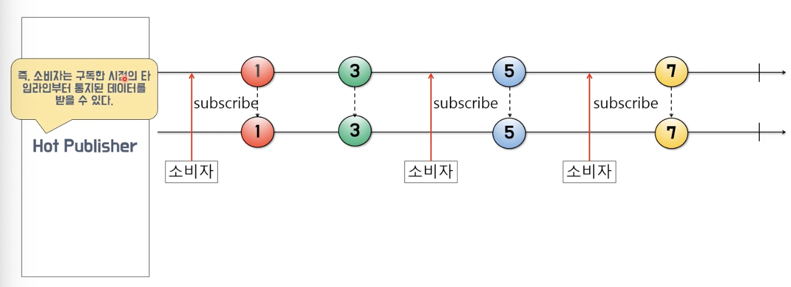
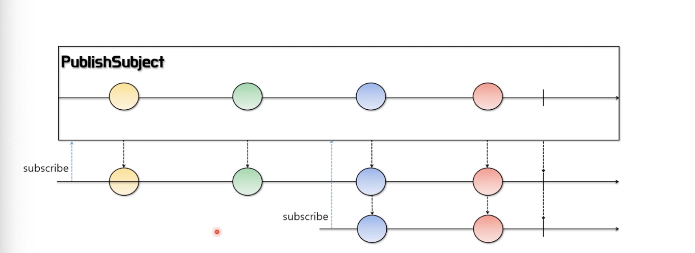
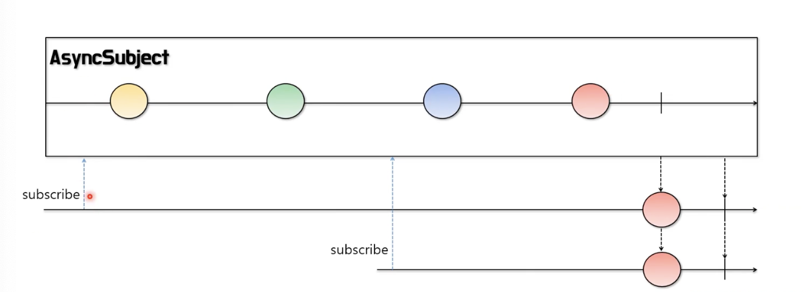
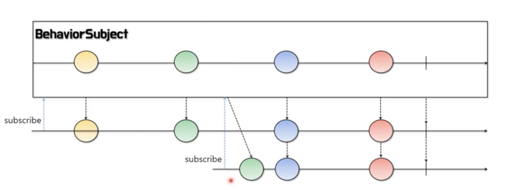
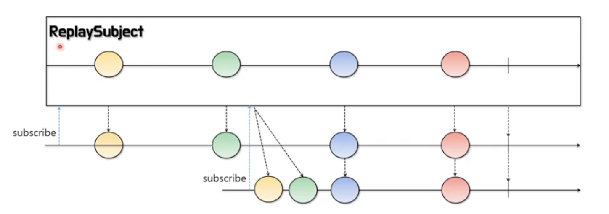

# Kevin의 알기 쉬운 RxJava 2부
## 0. Processor와 Subject

### Processor와 Subject란?
- Processor는 Reactive Streams에서 정의한 Publisher 인터페이스와 Subscriber 인터페이스를 둘 다 상속한 확장 인터페이스이다.
  
- 즉, Processor는 Publisher(생산자)의 기능과 Subscriber(소비자)의 기능을 모두 가지고 있다.
- Processor는 Hot Publisher(뜨거운 생산자)이다.
- Subject는 Reactive Streams의 Processor와 동일한 기능을 하나 배압 기능이 없는 추상 클래스이다.
- Processor와 Subject의 구현 클래스에는 다음과 같은 클래스가 있다.
  - PublishProcessor / PublishSubject
  - AsyncProcessor / AsyncSubject
  - BehaviorProcessor / BehaviorSubject
  - ReplayProcessor / ReplaySubject
 
#### Cold Publisher / Hot Publisher Review
- Cold Publisher(차가운 생산자)
  - 
- Hot Publisher(뜨거운 생산자)
  - 

### **Processor** / Subject
> **Processor, Subject의 차이점은 배압 기능의 유무이다.**
- **PublishSubject**
  - 소비자가 구독 전에 통지된 데이터는 받을 수 없고, 구독한 이후에 통지 된 데이터만 소비자에게 전달된다.
  - 데이터 통지가 완료 된 이후에 소비자가 구독하면 완료 또는 에러 통지를 받는다.
  - 

### Processor / **Subject**
- **AsyncSubject**
  - 완료 전까지 아무것도 통지하지 않고 있다가 완료했을 때 마지막으로 통지한 데이터와 완료만 통지한다.
  - 모든 소비자는 구독 시점에 상관없이 마지막으로 통지된 데이터와 완료 통지만 받는다.
  - 완료 후에 구독한 소비자라도 마지막으로 통지된 데이터와 완료 통지를 받는다.
  - 
- **BehaviorSubject**
  - 구독 시점에 이미 통지된 데이터가 있다면 이미 통지된 데이터의 마지막 데이터를 전달 받은 후, 구독 이후에 통지된 데이터를 전달 받는다.
  - 처리가 완료된 이후에 구독하면 완료나 에러 통지만 전달 받는다.
  - 
- **ReplaySubject**
  - 구독 시점에 이미 통지된 데이터가 있다면 이미 통지된 데이터 중에서 최근 통지된 데이터를 지정한 개수만큼 전달 받은 후, 구독 이후에 통지된 데이터를 전달받는다.
  - 이미 처리가 완료된 이후에 구독하더라도 지정한 개수 만큼의 최근 통지된 데이터를 전달 받는다.
  - 
