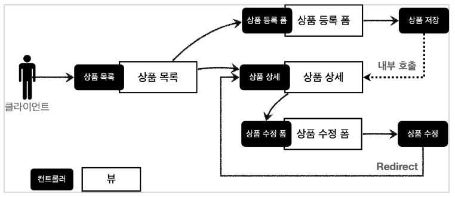

# 스프링 MVC 1편 - 백엔드 웹 개발 핵심 기술
> study log
--- 
### Commit Role

  

    <code>Commit Type</code> 
  

##### type

- feat : 새로운 기능 추가, 기존의 기능을 요구 사항에 맞추어 수정
- fix : 기능에 대한 버그 수정
- build : 빌드 관련 수정
- chore : 패키지 매니저 수정, 그 외 기타 수정 ex) .gitignore
- ci : CI 관련 설정 수정
- docs : 문서(주석) 수정
- style : 코드 스타일, 포맷팅에 대한 수정
- refactor : 기능의 변화가 아닌 코드 리팩터링 ex) 변수 이름 변경
- test : 테스트 코드 추가/수정
- release : 버전 릴리즈

---
### link

--- 

## 요구사항 분석

### 상품 도메인 모델
- 상품 ID
- 상품명
- 가격
- 수량

### 상품 관리 기능
- 상품 목록
- 상품 상세
- 상품 등록
- 상품 수정

### 서비스 제공 흐름

---

