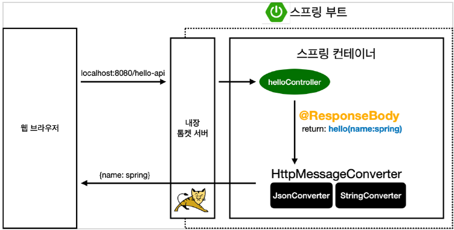
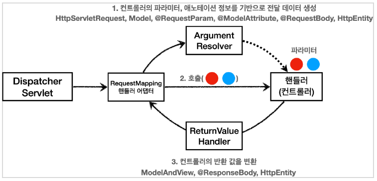
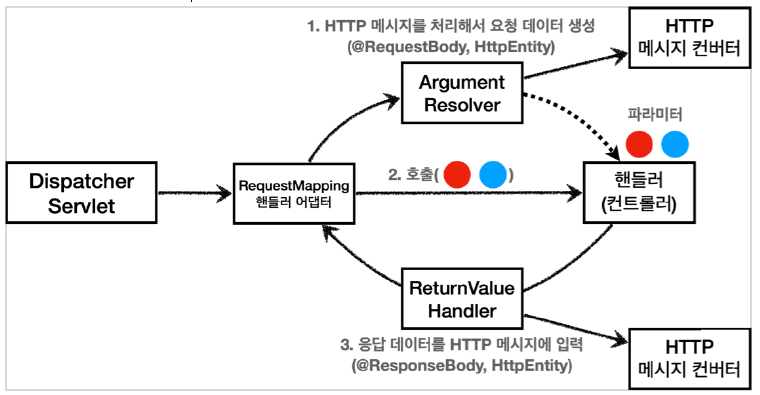

# 스프링 MVC 1편 - 백엔드 웹 개발 핵심 기술
> to study Spring-MVC
--- 
<details>
  <summary>
    <code>Commit Type</code> 
  </summary>

#### type

- feat : 새로운 기능 추가, 기존의 기능을 요구 사항에 맞추어 수정
- fix : 기능에 대한 버그 수정
- build : 빌드 관련 수정
- chore : 패키지 매니저 수정, 그 외 기타 수정 ex) .gitignore
- ci : CI 관련 설정 수정
- docs : 문서(주석) 수정
- style : 코드 스타일, 포맷팅에 대한 수정
- refactor : 기능의 변화가 아닌 코드 리팩터링 ex) 변수 이름 변경
- test : 테스트 코드 추가/수정
- release : 버전 릴리즈
</details>

---
## summary
### Logging
- 로그가 출력되는 포멧 확인
   - 시간, 로그 레벨, 프로세스 ID, 쓰레드 명, 클래스명, 로그 메시지
- 로그 레벨 설정을 변경해서 출력 결과를 보자.
   - `LEVEL: TRACE > DEBUG > INFO > WARN > ERROR`
   - 개발 서버는 debug 출력
   - 운영 서버는 info 출력
- `@Slf4j` 로 변경
- 
#### application.properties
```properties
#전체 로그 레벨 설정(기본 info)
logging.level.root=info

#hello.springmvc 패키지와 그 하위 로그 레벨 설정
logging.level.hello.springmvc=debug
```

### 올바른 로그 사용법
> log.debug("data="+data)
- 로그 출력 레벨을 info로 설정해도 해당 코드에 있는 "data="+data가 실제 실행이 되어 버린다.
- 결과적으로 문자 더하기 연산이 발생한다.
> log.debug("data={}", data)
- 로그 출력 레벨을 info로 설정하면 아무일도 발생하지 않는다. 따라서 앞과 같은 의미없는 연산이 발생하지 않는다.

### 로그 사용시 장점
- 쓰레드 정보, 클래스 이름 같은 부가 정보를 함께 볼 수 있고, 출력 모양을 조정할 수 있다.
- 로그 레벨에 따라 개발 서버에서는 모든 로그를 출력하고, 운영서버에서는 출력하지 않는 등 로그를 상황에 맞게 조절할 수 있다.
- 시스템 아웃 콘솔에만 출력하는 것이 아니라, 파일이나 네트워크 등, 로그를 별도의 위치에 남길 수 있다. 특히 파일로 남길 때는 일별, 특정 용량에 따라 로그를 분할하는 것도 가능하다.
- 성능도 일반 System.out보다 좋다. (내부 버퍼링, 멀티 쓰레드 등등) 그래서 실무에서는 꼭 로그를 사용해야 한다.

---

### 매핑 정보
- `@RestController`
   - `@Controller` 는 반환 값이 `String` 이면 뷰 이름으로 인식된다. 그래서 **뷰를 찾고 뷰가 랜더링** 된다.
   - `@RestController` 는 반환 값으로 뷰를 찾는 것이 아니라, **HTTP 메시지 바디에 바로 입력**한다.

---

### 클라이언트에서 서버로 요청 데이터를 전달할 때는 주로 다음 3가지 방법
- **GET - 쿼리 파라미터**
   - > /url?username=hello&age=20
   - 메시지 바디 없이, URL의 쿼리 파라미터에 데이터를 포함해서 전달
   - 예) 검색, 필터, 페이징등에서 많이 사용하는 방식
- **POST - HTML Form**
   - > content-type: application/x-www-form-urlencoded
   - 메시지 바디에 쿼리 파리미터 형식으로 전달 username=hello&age=20
   - 예) 회원 가입, 상품 주문, HTML Form 사용
- **HTTP message body**에 데이터를 직접 담아서 요청
   - HTTP API에서 주로 사용, JSON, XML, TEXT
   - 데이터 형식은 주로 JSON 사용
   - POST, PUT, PATCH 

> ### 요청 파라미터 - 쿼리 파라미터, HTML Form
> `HttpServletRequest` 의 `request.getParameter()` 를 사용하면 다음 두가지 요청 파라미터를 조회할 수 있다.

---
### @RestController
- @Controller 대신에 @RestController 애노테이션을 사용하면, 해당 컨트롤러에 모두 @ResponseBody 가 적용되는 효과가 있다. 
- 따라서 뷰 템플릿을 사용하는 것이 아니라, HTTP 메시지 바디에 직접 데이터를 입력한다. 이름 그대로 Rest API(HTTP API)를 만들 때 사용하는 컨트롤러이다.
- 참고로 @ResponseBody 는 클래스 레벨에 두면 전체 메서드에 적용되는데, @RestController 에노테이션 안에 @ResponseBody 가 적용되어 있다.

---
### HTTP Message Converter

- @ResponseBody 를 사용
   - HTTP의 BODY에 문자 내용을 직접 반환
    - viewResolver 대신에 HttpMessageConverter 가 동작
   - 기본 문자처리: StringHttpMessageConverter
   - 기본 객체처리: MappingJackson2HttpMessageConverter
   - byte 처리 등등 기타 여러 HttpMessageConverter가 기본으로 등록되어 있음
> 참고: 응답의 경우 **클라이언트의 HTTP Accept 해더와 서버의 컨트롤러 반환 타입 정보** 둘을 조합해서
> HttpMessageConverter 가 선택된다.  
---
### RequestMappingHandlerAdapter 동작 방식


### ArgumentResolver
- 생각해보면, 애노테이션 기반의 컨트롤러는 매우 다양한 파라미터를 사용할 수 있었다.
- `HttpServletRequest` , `Model` 은 물론이고, @RequestParam` , `@ModelAttribute` 같은 애노테이션 그리고 `@RequestBody` , `HttpEntity` 같은 HTTP 메시지를 처리하는 부분까지 매우 큰 유연함을 보여주었다.
- 이렇게 파라미터를 유연하게 처리할 수 있는 이유가 바로 `ArgumentResolver` 덕분이다.

- 애노테이션 기반 컨트롤러를 처리하는 `RequestMappingHandlerAdapter` 는 바로 이 `ArgumentResolver` 를 호출해서 컨트롤러(핸들러)가 필요로 하는 다양한 파라미터의 값(객체)을 생성한다.
- 그리고 이렇게 파리미터의 값이 모두 준비되면 컨트롤러를 호출하면서 값을 넘겨준다.

- 정확히는 HandlerMethodArgumentResolver 인데 줄여서 ArgumentResolver 라고 부른다.
```java
  public interface HandlerMethodArgumentResolver {
    boolean supportsParameter(MethodParameter parameter);
    
    @Nullable
    Object resolveArgument(MethodParameter parameter, @Nullable
      ModelAndViewContainer mavContainer,
      NativeWebRequest webRequest, @Nullable WebDataBinderFactory
      binderFactory) throws Exception;
  }
```

#### 동작 방식 
- `ArgumentResolver` 의 `supportsParameter()` 를 호출해서 해당 파라미터를 지원하는지 체크하고, 지원하면 `resolveArgument()` 를 호출해서 실제 객체를 생성한다. 그리고 이렇게 생성된 객체가 컨트롤러 호출시 넘어가는 것이다.

### ReturnValueHandler
- `HandlerMethodReturnValueHandler` 를 줄여서 ReturnValueHandler 라 부른다.
- `ArgumentResolver` 와 비슷한데, 이것은 응답 값을 변환하고 처리한다.
- 컨트롤러에서 String으로 뷰 이름을 반환해도, 동작하는 이유가 바로 ReturnValueHandler 덕분이다.
- 스프링은 10여개가 넘는 `ReturnValueHandler` 를 지원한다.
   - 예) `ModelAndView` , `@ResponseBody` , `HttpEntity` , `String`

### HTTP 메시지 컨버터
#### HTTP 메시지 컨버터 위치

- **요청의 경우**
   - `@RequestBody` 를 처리하는 `ArgumentResolver` 가 있고, `HttpEntity` 를 처리하는 `ArgumentResolver` 가 있다. 
   - 이 `ArgumentResolver` 들이 HTTP 메시지 컨버터를 사용해서 필요한 객체를 생성하는 것이다.
- **응답의 경우**
   - `@ResponseBody` 와 `HttpEntity` 를 처리하는 `ReturnValueHandler` 가 있다. 그리고 여기에서 HTTP 메시지 컨버터를 호출해서 응답 결과를 만든다.

> 스프링 MVC는 `@RequestBody` , `@ResponseBody` 가 있으면 `RequestResponseBodyMethodProcessor`(ArgumentResolver) HttpEntity 가 있으면 `HttpEntityMethodProcessor` (ArgumentResolver)를 사용한다.

### 확장
- 스프링이 필요한 대부분의 기능을 제공하기 때문에 실제 기능을 확장할 일이 많지는 않다. 
- 기능 확장은 `WebMvcConfigurer` 를 상속 받아서 스프링 빈으로 등록하면 된다. 
- 실제 자주 사용하지는 않으니 실제 기능 확장이 필요할 때 `WebMvcConfigurer` 를 검색해보자.
**WebMvcConfigurer 확장**
```java
  @Bean
  public WebMvcConfigurer webMvcConfigurer() {
      return new WebMvcConfigurer() {
          @Override
          public void addArgumentResolvers(List<HandlerMethodArgumentResolver> resolvers) {
                //...
          }
          @Override
          public void extendMessageConverters(List<HttpMessageConverter<?>>converters) {
                //...
          }
      };
  }
```
---

---
> 출처 : https://www.inflearn.com/course/%EC%8A%A4%ED%94%84%EB%A7%81-mvc-1#
--- 