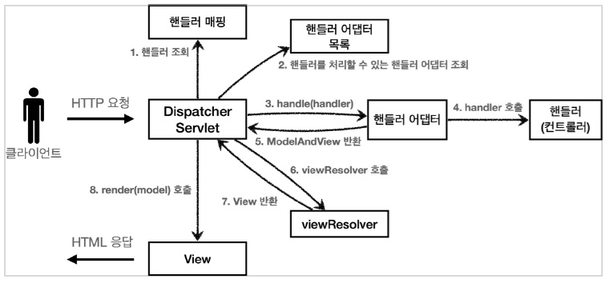

# study-spring-mvc1
> Study Spring-MVC Principle and Structure
---
<details>
  <summary>
    <code>Commit Type</code> 
  </summary>

#### type

- feat : 새로운 기능 추가, 기존의 기능을 요구 사항에 맞추어 수정
- fix : 기능에 대한 버그 수정
- build : 빌드 관련 수정
- chore : 패키지 매니저 수정, 그 외 기타 수정 ex) .gitignore
- ci : CI 관련 설정 수정
- docs : 문서(주석) 수정
- style : 코드 스타일, 포맷팅에 대한 수정
- refactor : 기능의 변화가 아닌 코드 리팩터링 ex) 변수 이름 변경
- test : 테스트 코드 추가/수정
- release : 버전 릴리즈
</details>


--- 
## HTTP 요청 데이터 - 개요
```text
HTTP 요청 메시지를 통해 클라이언트에서 서버로 데이터를 전달하는 방법을 알아보자.
```
- 주로 다음 3가지 방법을 사용한다.
- GET - 쿼리 파라미터
  - /url?username=hello&age=20
  - 메시지 바디 없이, URL의 쿼리 파라미터에 데이터를 포함해서 전달
  - 예) 검색, 필터, 페이징등에서 많이 사용하는 방식
- POST - HTML Form
  - content-type: application/x-www-form-urlencoded
  - 메시지 바디에 쿼리 파리미터 형식으로 전달 username=hello&age=20
  - 예) 회원 가입, 상품 주문, HTML Form 사용
- HTTP message body에 데이터를 직접 담아서 요청
  - HTTP API에서 주로 사용, JSON, XML, TEXT
  - 데이터 형식은 주로 JSON 사용
  - POST, PUT, PATCH
---
### get 과 POST HTML Form
- application/x-www-form-urlencoded 형식은 앞서 GET에서의 쿼리 파라미터 형식과 같다.
  - 따라서 쿼리 파라미터 조회 메서드를 그대로 사용하면 된다.
  - 클라이언트(웹 브라우저) 입장에서는 두 방식에 차이가 있지만, 서버 입장에서는 둘의 형식이 동일하므로,
  - request.getParameter() 로 편리하게 구분없이 조회할 수 있다.

> **참고** <br/>
> - content-type은 HTTP 메시지 바디의 데이터 형식을 지정한다.
> - **URL 쿼리 파라미터 형식** 으로 클라이언트에서 서버로 데이터를 전달할 때는 HTTP 메시지 바디를
사용하지 않기 때문에 content-type이 없다.
> - **POST HTML Form 형식** 으로 데이터를 전달하면 HTTP 메시지 바디에 해당 데이터를 포함해서 보내기
때문에 바디에 포함된 데이터가 어떤 형식인지 content-type을 꼭 지정해야 한다. 이렇게 폼으로 데이터를
전송하는 형식을 application/x-www-form-urlencoded 라 한다.

---
### 서블릿과 JSP의 한계
- Servlet
   - 뷰(View)화면을 위한 HTML을 만드는 작업이 자바 코드에 섞여서 지저분하고 복잡.
- JSP
   - JAVA 코드, 데이터를 조회하는 리포지토리 등등 다양한 코드가 모두 JSP에 노출되어 있다.
   - JSP가 너무 많은 역할을 한다. 이렇게 작은 프로젝트도 벌써 머리가 아파오는데, 수백 수천줄이 넘어가는 JSP를 떠올려보면 정말 지옥과 같을 것이다.
---
## MVC 패턴
### 개요
- 너무 많은 역할
   - 하나의 서블릿이나 JSP 만으로 비즈니스 로직과 뷰 렌더링까지 모두 처리하면 너무 많은 역할을 하게 된다.
- 변경의 라이프 사이클
   - UI를 일부 수정하는 일과 비즈니스 로직을 수정하는 일은 각각 다르게 발생한 가능성이 매우 높다.
- 기능 특화
   - JSP 같은 뷰 템플릿은 화면을 렌더링 하는데 최적화 되어 있기 때문에 이 부분의 업무만 담당하는게 효과적이다.
- Model View Controller
   - 컨트롤러: HTTP 요청을 받아서 파라미터를 검증하고, 비즈니스 로직을 실행한다. 그리고 뷰에 전달할 결과 데이터를 조회해서 모델에 담는다.
   - 모델: 뷰에 출력할 데이터를 담아둔다. 뷰가 필요한 데이터를 모두 모델에 담아서 전달해주는 덕분에 뷰는 비즈니스 로직이나 데이터 접근을 몰라도 되고, 화면을 렌더링 하는 일에 집중할 수 있다.
   - 뷰: 모델에 담겨있는 데이터를 사용해서 화면을 그리는 일에 집중한다. 여기서는 HTML을 생성하는 부분을 말한다.

redirect vs forward
> 리다이렉트는 실제 클라이언트(웹 브라우저)에 응답이 나갔다가, 클라이언트가 redirect 경로로 다시
요청한다. 따라서 클라이언트가 인지할 수 있고, URL 경로도 실제로 변경된다. 반면에 포워드는 서버
내부에서 일어나는 호출이기 때문에 클라이언트가 전혀 인지하지 못한다.
```text
참고
컨트롤러에 비즈니스 로직을 둘 수도 있지만, 이렇게 되면 컨트롤러가 너무 많은 역할을 담당한다. 그래서
일반적으로 비즈니스 로직은 서비스(Service)라는 계층을 별도로 만들어서 처리한다. 그리고 컨트롤러는
비즈니스 로직이 있는 서비스를 호출하는 역할을 담당한다. 참고로 비즈니스 로직을 변경하면 비즈니스
로직을 호출하는 컨트롤러의 코드도 변경될 수 있다. 앞에서는 이해를 돕기 위해 비즈니스 로직을
호출한다는 표현 보다는, 비즈니스 로직이라 설명했다.
```

### 한계
- 포워드 중복
   - View로 이동하는 코드가 항상 중복 호출되어야 한다. 물론 이 부분을 메서드로 공통화해도 되지만, 해당 메서드도 항상 직접 호출해야 한다.
```java
    RequestDispatcher dispatcher = request.getRequestDispatcher(viewPath);
    dispatcher.forward(request, response);
```
- ViewPath에 중복
   - prefix: /WEB-INF/views/
   - suffix: .jsp
> String viewPath = "/WEB-INF/views/new-form.jsp";
- 사용하지 않는 코드
   - 다음 코드를 사용할 때도 있고, 사용하지 않을 때도 있다. 특히 response는 현재 코드에서 사용되지 않는다.
   - 그리고 이런 HttpServletRequest , HttpServletResponse 를 사용하는 코드는 테스트 케이스를 작성하기도 어렵다.
> HttpServletRequest request, HttpServletResponse response
- 공통 처리가 어렵다.
   - 기능이 복잡해질 수 록 컨트롤러에서 공통으로 처리해야 하는 부분이 점점 더 많이 증가할 것이다. 
   - 단순히 공통 기능을 메서드로 뽑으면 될 것 같지만, 결과적으로 해당 메서드를 항상 호출해야 하고, 실수로 호출하지 않으면 문제가 될 것이다. 
   - 그리고 호출하는 것 자체도 중복이다.
- 정리하면 공통 처리가 어렵다는 문제가 있다.
   - 이 문제를 해결하려면 컨트롤러 호출 전에 먼저 공통 기능을 처리해야 한다. 
   - 소위 수문장 역할을 하는 기능이 필요하다. 프론트 컨트롤러(Front Controller) 패턴을 도입하면 이런 문제를 깔끔하게 해결할 수 있다. 
---
## Front Controller
### FrontController 패턴 특징
- 프론트 컨트롤러 서블릿 하나로 클라이언트의 요청을 받음
- 프론트 컨트롤러가 요청에 맞는 컨트롤러를 찾아서 호출
- 입구를 하나로!
- 공통 처리 가능
- 프론트 컨트롤러를 제외한 나머지 컨트롤러는 서블릿을 사용하지 않아도 됨
---
## View Resolver
> MyView view = viewResolver(viewName)
- 컨트롤러가 반환한 논리 뷰 이름을 실제 물리 뷰 경로로 변경한다. 그리고 실제 물리 경로가 있는 MyView 객체를 반환한다.
- 논리 뷰 이름: members
- 물리 뷰 경로: /WEB-INF/views/members.jsp
---
## DispatcherServlet 구조 살펴보기
### DispacherServlet 서블릿 등록
- `DispacherServlet` 도 부모 클래스에서 `HttpServlet` 을 상속 받아서 사용하고, 서블릿으로 동작한다.
   - > DispatcherServlet -> FrameworkServlet -> HttpServletBean -> HttpServlet
- 스프링 부트는 `DispacherServlet` 을 서블릿으로 자동으로 등록하면서 모든 경로`( urlPatterns="/" )`에 대해서 매핑한다.
   - > 참고: 더 자세한 경로가 우선순위가 높다. 그래서 기존에 등록한 서블릿도 함께 동작한다.
- 서블릿이 호출되면 `HttpServlet` 이 제공하는 `serivce()` 가 호출된다.
- 스프링 MVC는 `DispatcherServlet` 의 부모인 `FrameworkServlet` 에서 `service()` 를 오버라이드 해두었다.
- `FrameworkServlet.service()` 를 시작으로 여러 메서드가 호출되면서 `DispacherServlet.doDispatch()` 가 호출된다.

### DispacherServlet 의 핵심인 doDispatch()
```java
    protected void doDispatch(HttpServletRequest request, HttpServletResponse response) throws Exception {
        HttpServletRequest processedRequest = request;
        HandlerExecutionChain mappedHandler = null;
        ModelAndView mv = null;
        
        // 1. 핸들러 조회
        mappedHandler = getHandler(processedRequest);
        if (mappedHandler == null) {
            noHandlerFound(processedRequest, response);
            return;
        }
        // 2. 핸들러 어댑터 조회 - 핸들러를 처리할 수 있는 어댑터
        HandlerAdapter ha = getHandlerAdapter(mappedHandler.getHandler());
        
        // 3. 핸들러 어댑터 실행 -> 4. 핸들러 어댑터를 통해 핸들러 실행 -> 5. ModelAndView 반환
        mv = ha.handle(processedRequest, response, mappedHandler.getHandler());
        processDispatchResult(processedRequest, response, mappedHandler, mv, dispatchException);
    }

    private void processDispatchResult(HttpServletRequest request,
        
        HttpServletResponse response, HandlerExecutionChain mappedHandler, ModelAndView mv, Exception exception) throws Exception {
      
        // 뷰 렌더링 호출
        render(mv, request, response);
    }
    protected void render(ModelAndView mv, HttpServletRequest request, HttpServletResponse response) throws Exception {
    
        View view;
        String viewName = mv.getViewName();
        
        // 6. 뷰 리졸버를 통해서 뷰 찾기, 7. View 반환
        view = resolveViewName(viewName, mv.getModelInternal(), locale, request);
        
        // 8. 뷰 렌더링
        view.render(mv.getModelInternal(), request, response);
    }
```
## Spring MVC 구조


### 동작 순서
1. 핸들러 조회: 핸들러 매핑을 통해 요청 URL에 매핑된 핸들러(컨트롤러)를 조회한다.
2. 핸들러 어댑터 조회: 핸들러를 실행할 수 있는 핸들러 어댑터를 조회한다.
3. 핸들러 어댑터 실행: 핸들러 어댑터를 실행한다.
4. 핸들러 실행: 핸들러 어댑터가 실제 핸들러를 실행한다.
5. ModelAndView 반환: 핸들러 어댑터는 핸들러가 반환하는 정보를 ModelAndView로 변환해서 반환한다.
6. viewResolver 호출: 뷰 리졸버를 찾고 실행한다. 
   - JSP의 경우: InternalResourceViewResolver 가 자동 등록되고, 사용된다.
7. View 반환: 뷰 리졸버는 뷰의 논리 이름을 물리 이름으로 바꾸고, 렌더링 역할을 담당하는 뷰 객체를 반환한다.
   - JSP의 경우 InternalResourceView(JstlView) 를 반환하는데, 내부에 forward() 로직이 있다.
8. 뷰 렌더링: 뷰를 통해서 뷰를 렌더링 한다.


### 스프링 부트가 자동 등록하는 핸들러 매핑과 핸들러 어댑터
#### HandlerMapping
```text
0 = RequestMappingHandlerMapping : 애노테이션 기반의 컨트롤러인 @RequestMapping에서 사용
1 = BeanNameUrlHandlerMapping : 스프링 빈의 이름으로 핸들러를 찾는다.
```
#### HandlerAdapter
```text
0 = RequestMappingHandlerAdapter : 애노테이션 기반의 컨트롤러인 @RequestMapping에서 사용
1 = HttpRequestHandlerAdapter : HttpRequestHandler 처리
2 = SimpleControllerHandlerAdapter : Controller 인터페이스(애노테이션X, 과거에 사용) 처리
```

### @RequestMapping
- 가장 우선순위가 높은 핸들러 매핑과 핸들러 어댑터는 `RequestMappingHandlerMapping`, `RequestMappingHandlerAdapter` 이다.
- `@RequestMapping` 의 앞글자를 따서 만든 이름인데, 
- 이것이 바로 지금 스프링에서 주로 사용하는 애노테이션 기반의 컨트롤러를 지원하는 매핑과 어댑터이다. 
- 실무에서는 99.9% 이 방식의 컨트롤러를 사용한다.
  
#### priority
- `@RequestMapping` 
   - `RequestMappingHandlerMapping`
   - `RequestMappingHandlerAdapter`
---


---
```text
출처 : https://www.inflearn.com/course/%EC%8A%A4%ED%94%84%EB%A7%81-mvc-1
```