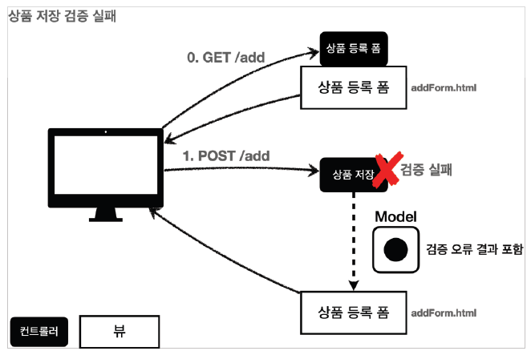

# 스프링 MVC 2편 - 백엔드 웹 개발 핵심 기술
## 검증1 - Validation
--- 
### Commit Role

  

    <code>Commit Type</code> 
  

##### type

- feat : 새로운 기능 추가, 기존의 기능을 요구 사항에 맞추어 수정
- fix : 기능에 대한 버그 수정
- build : 빌드 관련 수정
- chore : 패키지 매니저 수정, 그 외 기타 수정 ex) .gitignore
- ci : CI 관련 설정 수정
- docs : 문서(주석) 수정
- style : 코드 스타일, 포맷팅에 대한 수정
- refactor : 기능의 변화가 아닌 코드 리팩터링 ex) 변수 이름 변경
- test : 테스트 코드 추가/수정
- release : 버전 릴리즈

---
### 검증 요구사항
- 상품 관리 시스템에 새로운 요구사항이 추가되었다.
- **요구사항: 검증 로직 추가**
   - 타입 검증
      - 가격, 수량에 문자가 들어가면 검증 오류 처리
   - 필드 검증
      - 상품명: 필수, 공백X
      - 가격: 1000원 이상, 1백만원 이하
      - 수량: 최대 9999
   - 특정 필드의 범위를 넘어서는 검증
      - 가격 * 수량의 합은 10,000원 이상
     
- 지금까지 만든 웹 애플리케이션은 폼 입력시 숫자를 문자로 작성하거나해서 검증 오류가 발생하면 오류 화면으로 바로 이동한다. 
- 이렇게 되면 사용자는 처음부터 해당 폼으로 다시 이동해서 입력을 해야 한다.
- 아마도 이런 서비스라면 사용자는 금방 떠나버릴 것이다. 
- 웹 서비스는 폼 입력시 오류가 발생하면, 고객이 입력한 데이터를 유지한 상태로 어떤 오류가 발생했는지 친절하게 알려주어야 한다.
- 컨트롤러의 중요한 역할중 하나는 HTTP 요청이 정상인지 검증하는 것이다. 
- 그리고 정상 로직보다 이런 검증 로직을 잘 개발하는 것이 어쩌면 더 어려울 수 있다.
> **참고: 클라이언트 검증, 서버 검증**
> - 클라이언트 검증은 조작할 수 있으므로 보안에 취약하다.
> - 서버만으로 검증하면, 즉각적인 고객 사용성이 부족해진다.
> - 둘을 적절히 섞어서 사용하되, 최종적으로 서버 검증은 필수
> - API 방식을 사용하면 API 스펙을 잘 정의해서 검증 오류를 API 응답 결과에 잘 남겨주어야 함

#### 상품 저장 검증 실패

- 고객이 상품 등록 폼에서 상품명을 입력하지 않거나, 가격, 수량 등이 너무 작거나 커서 검증 범위를 넘어서면, 서버 검증 로직이 실패해야 한다. 
- 이렇게 검증에 실패한 경우 고객에게 다시 상품 등록 폼을 보여주고, 어떤 값을 잘못 입력했는지 친절하게 알려주어야 한다.
---